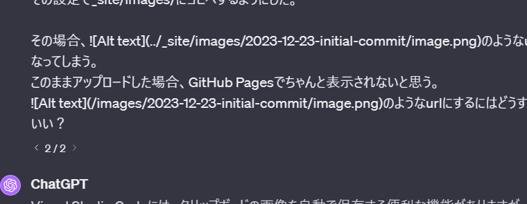

作ってみたはいいけど使わなそう
- GitHub Copilotでブログも書けないか試したかったけどmarkdownでは補完されなさそう
- VSCodeの画像貼り付けと相性が悪くてクリップボードの画像をそのまま貼り付けるのができなさそうだから使わなそう
    - 以下みたいな設定をプロジェクトフォルダに置いた
    - urlは``になるのでVSCodeのプレビュー機能では表示されるがサイト側ではリンク切れになる
    - `` にすればサイト側で表示されるけどVSCodeのプレビューでは表示されなくなる、両立させる方法がなさそう
    - VSCodeの設定ではたぶん無理
    - Jekyllの設定で出来るのかもしれないけど分からない
    - Git Hookで置き換えても上記の問題は発生する

```json
{
  "markdown.copyFiles.destination": {
    "/_posts/*": "${projectRoot}/images/${documentBaseName}/"
  }
}
```


